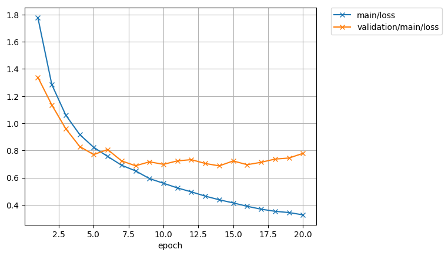
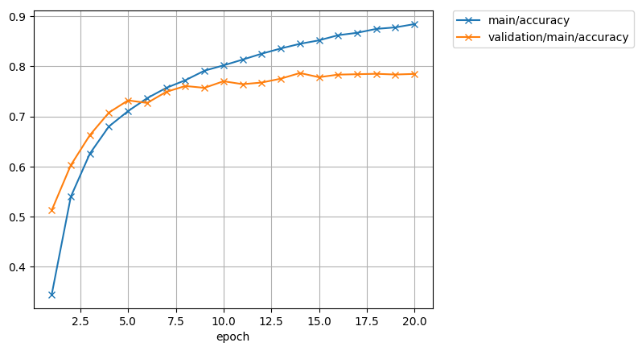

chainerでCIFAR10分類やってみる
===

## 使い方
実行: 
```
python main.py --batch_size [BATCH_SIZE] -- epoch [EPOCH]--learning_rate [LEANING_RATE] --gpu_idx [GPU_IDX]
```

- オプション
  - `--batch_size`: バッチサイズ (デフォルト 100)

  - `--epoch`: エポック数 (デフォルト 10)

  - `--learning_rate`: 学習率 (デフォルト 1e-08)

  - `--gpu_idx`: 使用するGPU (デフォルト -1 (使用しない))


## コード
- **network.py**
```
class Model(Chain):
    def __init__(self, channel=3, c1=32, c2=32,c3=64,c4=512, f1=1024, n_out=10, filter_size=3):
        super(Model, self).__init__(
            conv1=L.Convolution2D(channel,c1,filter_size),
            conv2=L.Convolution2D(None, c2, filter_size),
            conv3=L.Convolution2D(None, c3, filter_size),
            conv4=L.Convolution2D(None, c4, filter_size),
            l1=L.Linear(None, f1),
            l2=L.Linear(None, n_out)
        )

    def __call__(self, x):
        x = x.reshape((len(x), 3, 32, 32))
        ##forward
        h=F.relu(self.conv1(x))
        h=F.relu(self.conv2(h))
        h=F.max_pooling_2d(h,2)
        h = F.dropout(h)
        h=F.relu(self.conv3(h))
        h=F.relu(self.conv4(h))
        h=F.max_pooling_2d(h,2)
        h=F.dropout(F.relu(self.l1(h)))
        y=self.l2(h)
        return y

 ```
 こんなかんじ
 
 
 
- **main.py**

もともとchainerでデータセットが提供されてるけどちゃんと書いてみた。
```
def unpickle(f):
    import cPickle
    fo = open(f, 'rb')
    d = cPickle.load(fo)
    fo.close()
    return d
    
def main():
    args=get_args()

    train_data=None
    train_label=[]
    for i in range(1,6):
        d=unpickle("cifar-10-batches-py/data_batch_%d" %i)
        if i==1:
            train_data=d['data']
        else:
            train_data=np.vstack((train_data,d['data']))
        train_label=train_label+d['labels']

    train_data=train_data.reshape((len(train_data),3,32,32))
    train_label=np.array(train_label)

    test_d=unpickle("cifar-10-batches-py/test_batch")
    test_data=test_d['data']
    test_data=test_data.reshape((len(test_data),3,32,32))
    test_label=np.array(test_d['labels'])

    train_data = train_data.astype(np.float32)
    test_data = test_data.astype(np.float32)
    train_data /= 255
    test_data /= 255
    train_label = train_label.astype(np.int32)
    test_label = test_label.astype(np.int32)

    train = chainer.datasets.tuple_dataset.TupleDataset(train_data,train_label)
    test = chainer.datasets.tuple_dataset.TupleDataset(test_data, test_label)

    minibatch_size = args.batch_size
    train_iter = iterators.SerialIterator(train, minibatch_size)
    test_iter = iterators.SerialIterator(test, minibatch_size, False, False)
```

いろいろ準備。
```
    model = Model()

    if args.gpu_idx>=0:
        chainer.cuda.get_device(args.gpu_idx).use()
        model.to_gpu(args.gpu_idx)


    model=L.Classifier(model)

    optimizer=optimizers.Adam(eps=args.learning_rate)
    optimizer.setup(model)
    
    updater=training.updaters.StandardUpdater(train_iter, optimizer, device=args.gpu_idx)

    max_epoch=args.epoch
```
学習にはtrainerを使います。
```
    trainer=training.Trainer(updater, (max_epoch, 'epoch'),out='cifar10_result')

    #save the log
    trainer.extend(extensions.LogReport())

    #save the model per 5 epoch
    trainer.extend(extensions.snapshot(), trigger=(5, 'epoch'))
    
    #validation
    trainer.extend(extensions.Evaluator(test_iter, model,device=args.gpu_idx))

    #print the log
    trainer.extend(extensions.PrintReport(
        ['epoch', 'main/loss', 'main/accuracy', 'validation/main/loss', 'validation/main/accuracy', 'elapsed_time']))	

    #save the glaph
    trainer.extend(extensions.dump_graph(root_name="main/loss", out_name="cg.dot"))	

    #save the loss glaph
    trainer.extend(extensions.PlotReport(['main/loss', 'validation/main/loss'], x_key='epoch', file_name='loss.png'))
    #save the accuracy glaph
    trainer.extend(
        extensions.PlotReport(['main/accuracy', 'validation/main/accuracy'], x_key='epoch', file_name='accuracy.png'))

    #print the progress bar
    trainer.extend(extensions.ProgressBar())

    trainer.run()
```
PlotReportで出てきたグラフ



