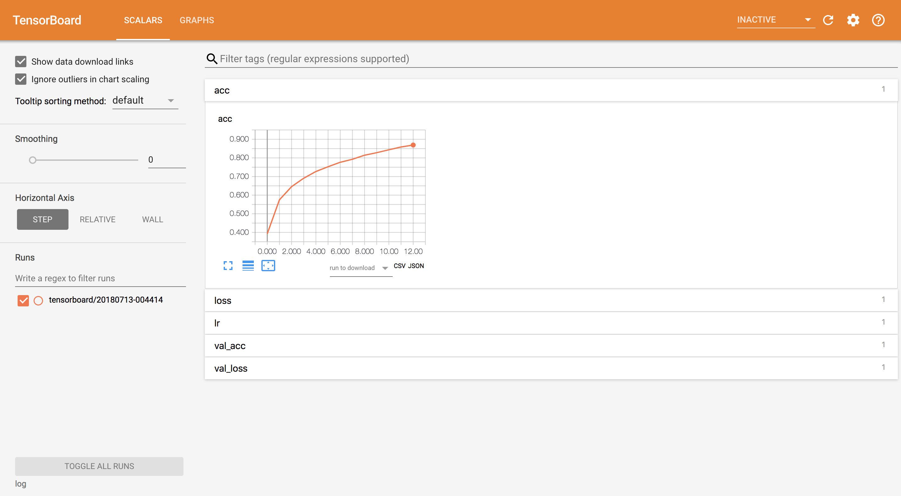
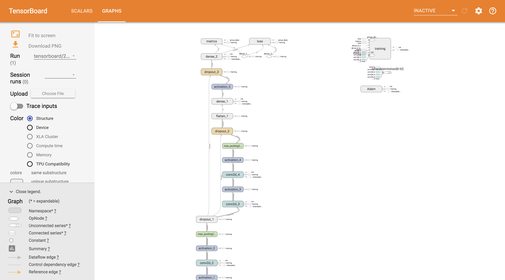
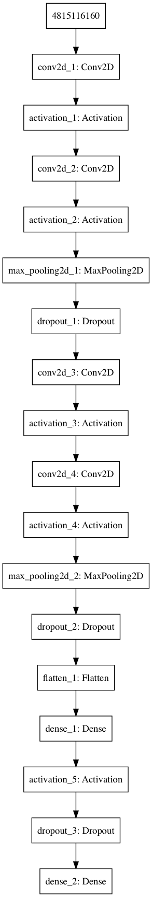

## 開発環境
- Mac book pro OS Sierra
- Python 3.6.5
- keras 2.2.0
- pyenv
- pyenv-virtualenv

## 概要

tensorboardでの可視化とか、callbackとか、modelのプロットとか  
ちなみに下記サイトに色々載ってたので、正直これ見る必要ないと思います。  
[Qiita: KerasでTensorboardを使用する際のTips](https://qiita.com/GushiSnow/items/6808121ba54fb2e53497)  
また、Callbackに関しては公式ドキュメントにも色々載ってます。  
(自作 Callback とかも)  
[Keras documentation コールバック](https://keras.io/ja/callbacks/)

ちなみに、tensorboardには下記のように出力される。  
accuracyの値とかは自動で更新される。

  



## 使い方

```
python make.py 
python main.py # 学習 & 評価
```

- main.py オプション
    - --train_dataset_path: 学習用データセットへのパス。 "画像のパス,ラベル" の形式
    - --validation_dataset_path: 評価用データセットへのパス。 "画像のパス,ラベル" の形式
    - --test_dataset_path: テスト用データセットへのパス。 "画像のパス,ラベル" の形式
    - --model_type: "sequential" or "functional". シーケンシャルモデル、ファンクショナルモデルのどちらを使用するか。（ネットワークは同じ）
    - --batch_size: バッチサイズ
    - --epochs: 学習エポック数
    - --learning_rate: 学習率
    - --log_dir: ログを出力するディレクトリ
    - --checkpoint_dir: 学習済みの重みを出力するディレクトリ 

Tensorboradで表示するには、下記コマンドを使用

```
$ tensorboard --logdir=log
2018-07-13 01:14:57.029286: I tensorflow/core/platform/cpu_feature_guard.cc:140] Your CPU supports instructions that this TensorFlow binary was not compiled to use: AVX2 FMA
TensorBoard 1.8.0 at http://UernamenoMacBook-Pro.local:6006 (Press CTRL+C to quit)
```

これで、`http://UernamenoMacBook-Pro.local:6006`にアクセスすると、表示されると思いきや、少しはまった。下記URLで表示された。  
ubuntuでは上の出力で表示されているURLにアクセスすることで表示されるので、Macだけの現象かもしれない。

```
http://localhost:6006
```

ちなみに、複数のtensorboardを表示したい場合は下記のように使用するポートを変更する。

```
$ tensorboard --logdir=log --port=6007
2018-07-13 01:20:26.718088: I tensorflow/core/platform/cpu_feature_guard.cc:140] Your CPU supports instructions that this TensorFlow binary was not compiled to use: AVX2 FMA
TensorBoard 1.8.0 at http://UernamenoMacBook-Pro.local:6007 (Press CTRL+C to quit)
```

## Callbackの使い方
keras.callback から使用したいコールバックを選んでリストに格納し、model.fit や model.fit_generator の引数の callbacksに渡す。

```
# 使用したい callback を keras.callback より選んで、リストに格納
def get_callback(tensorboad_log_dir, csv_name, checkpoint_name):
    callbacks = []
    callbacks.append(EarlyStopping(monitor="val_loss", mode="auto", patience=20))
    callbacks.append(TensorBoard(log_dir=tensorboad_log_dir, write_graph=True, write_grads=False))
    callbacks.append(ReduceLROnPlateau(monitor="val_loss", factor=0.1, patience=5, verbose=1, mode="auto"))
    callbacks.append(CSVLogger(csv_name))
    callbacks.append(ModelCheckpoint(checkpoint_name, monitor="val_loss", verbose=1, save_best_only=True, mode="auto"))
    return callbacks

def main():

# 省略 #

	# get callback
    callbacks = get_callback(tensorboard_log_path, csv_log_path, model_path)

    # learning
    # fit や fit_generator の引数 callbacksにkeras.callbacksのリストを指定
    model.fit_generator(train_dataset.get_batch(), train_dataset.get_iter_num(), epochs,
                        verbose=1, validation_data=validation_dataset.get_batch(),
                        validation_steps=validation_dataset.get_iter_num(), shuffle=False,
                        callbacks=callbacks) 
```

一応、今回指定したcallbackについて説明しておく。  
詳しくは[公式ドキュメント](https://keras.io/ja/callbacks/)を参照。

### EarlyStopping

```
EarlyStopping(monitor="val_loss", mode="auto", patience=20)
```

`monitor`に指定したメトリクスが変化しなくなった時に学習を止める。

### ReduceLROnPlateau

```
ReduceLROnPlateau(monitor="val_loss", factor=0.1, patience=5, verbose=1, mode="auto")
```

`monitor`で指定した値が変化しなくなった時に、学習率を`factor`倍する。  
学習が進まなくなった時に、学習率を小さくすると、学習が進む場合がある。

### ModelCheckpoint

```
ModelCheckpoint(checkpoint_name, monitor="val_loss", verbose=1, save_best_only=True, mode="auto")
```

モデルの重みを保存する。  
最も良い値のみを保存するか、数エポックごとに保存するとかを選べる。

### TensorBoard

```
TensorBoard(log_dir=tensorboad_log_dir, write_graph=True, write_grads=False)
```

Tensorboardで表示する用のLogを出力する。

### CSVLogger

```
CSVLogger(csv_name)
```

下記のような出力が得られる。

```
epoch,acc,loss,lr,val_acc,val_loss
0,0.3925391737891738,1.6551631261140873,0.001,0.5310496794871795,1.3291472074313042
1,0.574857372085898,1.1900426397180788,0.001,0.645935960591133,1.0100282620522385
2,0.6457033339488696,0.9939924989139403,0.001,0.6923234811165846,0.8774987022669248
3,0.6910322695986475,0.873696724081405,0.001,0.7161330049261084,0.8279996172498991
```

## plot_model

こんな感じのネットワーク図を出力する。  


これを出力するには、下記ライブラリが必要だった。  
`graphviz`は homebrew でインストールした。

```
pip install pydot3 pydot-ng graphviz
brew install graphviz
```
